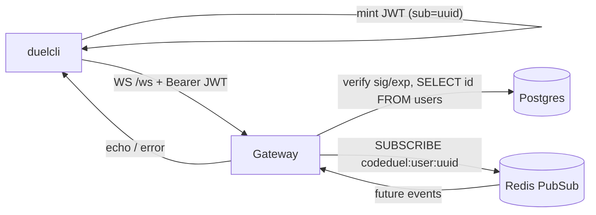

## Phase 2 — API Gateway (WS hub + auth + fan-out)

> Superseded behavior: Phase 3 replaces the local `join_queue` echo with Redis-backed
> FIFO matchmaking. A successful join now has no immediate response; `match_start` is
> the next client-visible event. The temporary `submit_code` acknowledgment remains.

This document records the original Phase 2 stateless WebSocket hub design. At that
phase, inbound intents were validated and echoed while Pub/Sub fan-out was prepared
for later publishers. See `phase_3_matchmaking.md` for the current queue behavior.

### Decisions (confirmed)
- Auth: **JWT (HS256)** signed with a shared `JWT_SECRET`; claim `sub` = user UUID. Gateway validates signature + `exp`, extracts `sub`, and confirms the user exists in `users`. Real login/registration remains out of scope (MVP mints dev tokens locally).
- WebSocket lib: `github.com/gorilla/websocket` (gateway + duelcli); JWT lib: `github.com/golang-jwt/jwt/v5`.
- Fan-out routing: per-user Redis Pub/Sub channel `codeduel:user:<uuid>`; each gateway subscribes only for users whose sockets it owns, so it naturally forwards only what it owns.

### 1. Shared message types — `internal/proto/`
New package `messages.go` with a JSON envelope and typed payloads:
- Envelope: `{ "type": string, "data": json.RawMessage }`.
- Inbound: `join_queue` (no fields for MVP), `submit_code` (`language`, `code`).
- Outbound: `match_start` (`match_id`, `problem_id`, `deadline`), `judging` (`submission_id`), `result` (`match_id`, `winner_id`, `tests_passed`, `outcome`), plus `error` (`message`).
- Small `Encode`/`Decode` helpers so gateway and duelcli share one wire format.

### 2. Auth — `internal/gateway/auth.go`
Auth is a handshake gate on `GET /ws`: prove identity **before** the WebSocket upgrade, so a failure is a normal HTTP 401 (after upgrade you can only close the socket). `/healthz` stays unauthenticated. This phase implements only the **verify** half of auth; login/registration (the **issuance** half) is deferred (see note below).

Two exported functions:
- `MintToken(userID uuid.UUID, secret string, ttl time.Duration) (string, error)` — sets `sub` (user UUID), `iat`, `exp = now+ttl`; signs HS256. Reused by duelcli so the signing format lives in one place.
- `Authenticate(ctx context.Context, r *http.Request, secret string, db *pgxpool.Pool) (uuid.UUID, error)` — returns the authenticated user UUID; the `/ws` handler maps any error to `http.Error(w, "unauthorized", 401)` and returns without upgrading.

Token: HS256 JWT signed with shared `JWT_SECRET`. Claims: `sub` = user UUID (only identity claim), `exp` required, `iat` set by `MintToken`. No `iss`/`aud` for MVP.

`Authenticate` steps (any failure -> 401):
1. Extract JWT: `Authorization: Bearer <jwt>` header first (duelcli sets it), else `?token=` query param (browser WS clients can't set headers). Do not accept a raw UUID as a token.
2. Parse/verify with `jwt.Parse` using `secret`, passing `jwt.WithValidMethods([]string{"HS256"})` (reject `none`/RSA -> alg-confusion) and `jwt.WithExpirationRequired()` (jwt/v5 validates `exp` when present; also reject tokens that omit it).
3. Extract `sub` via `claims.GetSubject()`, `uuid.Parse` it.
4. Confirm the user exists: `SELECT id FROM users WHERE id = $1` via `deps.Postgres` (`pgx.ErrNoRows` -> 401). DB access stays inline here (no `internal/store` layer yet; single query).

Return a uniform 401 body (`unauthorized`); do not leak *why* to the client, but log the reason server-side.

Failure matrix (drives the verification checklist): missing token / bad signature / non-HS256 or `alg:none` / expired `exp` / missing `exp` / `sub` missing or not a UUID / valid JWT whose `sub` is not in `users` -> all 401. Valid JWT for a seeded user -> 101 Switching Protocols.

Note (why no login/registration here): the gateway only needs a trustworthy `userID`, and JWT decouples issuance from verification — whoever mints the token (dev `MintToken`/duelcli now, a real login service later) is irrelevant to the gateway as long as it signs with `JWT_SECRET` and sets `sub`. The `users` table already carries `email`/`password_hash` for a future flow; adding real signup (HTTP handlers, password hashing, rate limiting, refresh/revocation) is its own phase and would balloon Phase 2's scope. This keeps the hub buildable and testable now via `MintToken` + a seeded user UUID.

### 3. Socket registry — `internal/gateway/registry.go`
- `Registry` holds `map[uuid.UUID]*conn` guarded by a `sync.RWMutex` (per-instance only; no cross-instance state, keeping the gateway stateless re: game logic).
- `Add`/`Remove`/`Get`; supports a single active socket per user for MVP (new connection replaces/closes the old one).
- `conn` wraps `*websocket.Conn` with a buffered send channel + write mutex so multiple goroutines (reader, heartbeat, pub/sub) never write concurrently.

### 4. Connection lifecycle — `internal/gateway/conn.go`
- `readPump`: sets read deadline, `SetPongHandler` extends it; decodes envelopes; validates via `internal/proto`; for MVP echoes recognized intents back (e.g. `join_queue` -> echo, `submit_code` -> `judging` ack) and returns `error` for unknown types.
- `writePump`: drains the send channel, periodic `ping` (ticker < read deadline), applies write deadline.
- On disconnect: unsubscribe the user's Pub/Sub channel and `Registry.Remove`.

### 5. Pub/Sub fan-out — `internal/gateway/pubsub.go`
- On successful auth, `deps.Redis.Subscribe(ctx, "codeduel:user:"+userID)`.
- Goroutine ranges over the subscription channel and pushes each payload onto that conn's send channel (already valid proto JSON from the publisher).
- Unsubscribe + close on disconnect. Nothing publishes yet in Phase 2; this is the receive side only.

### 6. HTTP server — `internal/gateway/run.go` (replaces stub)
- Build `http.ServeMux`: `GET /healthz` (200) and `GET /ws` (auth -> `websocket.Upgrader.Upgrade` -> register -> subscribe -> start pumps).
- `http.Server` with sane timeouts; run in a goroutine; on `ctx.Done()` do `server.Shutdown` with a short timeout, close all sockets. Preserve the existing graceful-shutdown contract (`Run(ctx, deps)` returning to `main.go`).

### 7. Config — `internal/config/config.go`
- Add `GatewayConfig{ Addr string; JWTSecret string }` from `GATEWAY_ADDR` (default `:8080`) and `JWT_SECRET` (dev default, required-ish), plus heartbeat/deadline durations (constants are fine; env optional). Add `GATEWAY_ADDR` and `JWT_SECRET` to `.env.example`.

### 8. Test client — `tools/duelcli/main.go`
- Flags: `-url` (default `ws://localhost:8080/ws`), `-user` (user UUID) + `-secret` (JWT secret, default from `JWT_SECRET` env). Mints a JWT via the shared `MintToken` helper and dials with the `Authorization: Bearer` header. Optional `-token` to pass a raw pre-signed JWT instead.
- Goroutine prints all inbound messages; reads stdin lines mapped to intents (`join`, `submit <lang> <code>`), encodes via `internal/proto`, sends. Ctrl-C closes cleanly.

### 9. Deps + Makefile
- `go get github.com/gorilla/websocket`, `github.com/golang-jwt/jwt/v5`, and `github.com/google/uuid` (uuid already transitively present via pgx; add as direct). `go mod tidy`.
- Add Makefile target `run-cli` -> `go run ./tools/duelcli -user=$(USER_ID)`.

### Data flow

### Verification
- `make up && make migrate`; note a seeded dev user UUID.
- `make run-gateway`; `make run-cli USER_ID=<uuid>` mints a JWT and connects. A JWT with unknown/absent `sub`, bad signature, or expired `exp` -> 401.
- Send `join`/`submit` -> receive echo/`judging`; kill duelcli -> gateway logs reap via missed pongs.
- `go build ./...` and `make lint` clean.

### Open item to confirm during build
- The `users` table currently has no seed row; JWT auth still confirms `sub` references a real user. Plan adds a small dev-users seed migration (`000003_seed_users.up.sql`) with two fixed UUIDs so duelcli can mint valid tokens. Flag if you'd rather create users another way.
