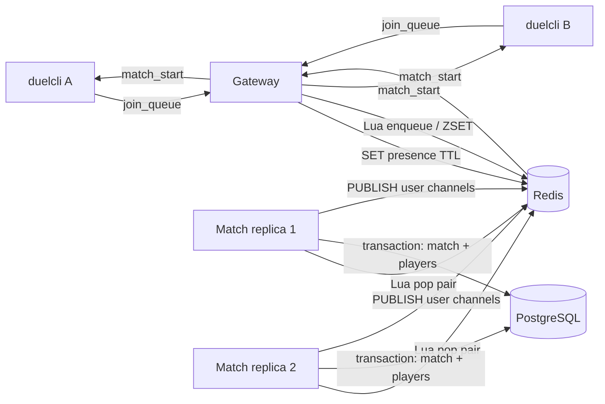

# Phase 3 - Matchmaking and Match Creation

Phase 3 replaces the Phase 2 `join_queue` echo with real FIFO matchmaking. The
Gateway writes authenticated players to Redis, the Match role atomically claims two
live players, creates the authoritative match in PostgreSQL, and publishes the same
`match_start` event to both players through the existing per-user Pub/Sub channels.

Reference requirements:

- `docs/plan/codeduel_incremental_build.md`, Phase 3
- `docs/architecture/README.md`, sections 2 and 3

## As-built status

Phases 3.1 through 3.6 were implemented on 2026-08-19. This document retains the
original goals and decisions, but the implementation and verification sections below
now describe the concrete code rather than proposed interfaces. Notable refinements
made during implementation are:

- Queue members must use the canonical route and a connection-specific presence key
  for their own user; non-nil canonical UUIDs are checked in both Go and Lua.
- `join_queue.data` is strict: omitted data, `null`, and `{}` are accepted, while
  client-supplied fields, non-object data, and trailing JSON are rejected.
- A queue ZSET entry is eligible only when the deduplication hash points to that exact
  encoded member. Orphaned or replaced ZSET entries are removed during bounded scans.
- Pong refresh uses `EXPIRE`, not `SET`, so cleanup and expiry cannot be undone by a
  late refresh. Pub/Sub subscription readiness is confirmed before registration and
  queue intents are accepted.
- Match shutdown uses a bounded two-second compensation context to requeue a pair when
  match creation observes cancellation after the pair was popped.
- Integration tests use dedicated Redis databases and disposable PostgreSQL databases,
  as detailed in the test sections.

## Goals

- Queue authenticated players in FIFO order in a Redis ZSET.
- Pair the two oldest live players atomically across concurrent Match replicas.
- Prevent a queued user from occupying more than one queue entry.
- Remove stale queue entries when their owning WebSocket is no longer live.
- Persist each match and its two players in one PostgreSQL transaction.
- Publish a shared `match_start` payload to both matched users.
- Verify that concurrent poppers never return the same queued player twice.

## Non-goals

- Rating-based matching; `rating` is stored as a `0` placeholder only.
- Submission persistence and judge queueing; these remain Phase 4 work.
- Durable event delivery or a PostgreSQL outbox for `match_start`.
- Match cancellation after a player disconnects.
- Reconnecting a player to an already-created match.
- Preventing every possible repeated-join race after a player has already been popped;
  Phase 3 guarantees deduplication while the player is present in the queue.
- ELO, parties, rematches, spectators, or multiple active sockets per user.

## Decisions

### Queue ingress

The Gateway writes `join_queue` directly to Redis. It does not forward the intent
through Pub/Sub because Pub/Sub is lossy and is intended only for outbound fan-out.
The ZSET itself is the handoff between Gateway and Match roles.

### Queue ordering

Queue order is based on Redis server time rather than a Gateway clock. The enqueue
Lua script stores a monotonic microsecond timestamp as the ZSET score. It reads
Redis `TIME` and advances the last score by one when two operations receive the same
or an earlier timestamp. This keeps ordering deterministic across Gateway replicas.

If the same connection sends `join_queue` repeatedly, the existing score is retained
so the player cannot improve or lose queue position by retrying.

### Routing hint

The queue member is JSON and contains the authenticated user ID, that connection's
presence key, the existing per-user Pub/Sub channel, and a rating placeholder:

```json
{
  "user_id": "11111111-1111-1111-1111-111111111111",
  "presence_key": "codeduel:presence:11111111-1111-1111-1111-111111111111:<connection-id>",
  "route": "codeduel:user:11111111-1111-1111-1111-111111111111",
  "rating": 0
}
```

The member remains self-contained for future routing and rating changes. PostgreSQL,
not this payload, remains authoritative for user and match data.

### Liveness

Each accepted WebSocket receives a random connection ID and owns a connection-specific
Redis presence key. The Gateway sets the key when the connection starts, refreshes its
TTL with `EXPIRE` after valid pong frames, and deletes it during connection cleanup.
`EXPIRE` deliberately does not recreate a lease that has already expired or been
deleted. A connection-specific key prevents an old replaced socket from deleting the
replacement socket's presence.

The presence TTL must exceed the current heartbeat interval. Use `75s` with the current
`54s` ping period and `60s` read timeout. A graceful disconnect is removed immediately;
an ungraceful disconnect is considered stale after the lease expires.

### Problem selection

Phase 3 uses the first available problem ordered by `created_at, id`. The Phase 1 seed
guarantees at least one problem in normal development. No random selection is needed
until the problem catalog grows.

### Publish semantics

The match transaction commits before publishing. Redis Pub/Sub delivery is best-effort
and can be lost if a Gateway is unavailable or the Match process crashes after commit.
An outbox/recovery mechanism is intentionally deferred because Phase 3 clients are
expected to remain connected while queued.

## Redis Contract

Use the following names in a new `internal/redisx` package:

| Purpose | Redis key/channel |
| --- | --- |
| FIFO waiting pool | `codeduel:matchmaking:queue` |
| User-to-member deduplication hash | `codeduel:matchmaking:members` |
| Last monotonic enqueue score | `codeduel:matchmaking:last-score` |
| WebSocket presence lease | `codeduel:presence:<user-id>:<connection-id>` |
| User event channel | `codeduel:user:<user-id>` |

Centralize these names in helper functions/constants so Gateway and Match do not
construct keys independently.

### Queue member type

Add a typed Go representation:

```go
type QueueMember struct {
	UserID      uuid.UUID `json:"user_id"`
	PresenceKey string    `json:"presence_key"`
	Route       string    `json:"route"`
	Rating      int       `json:"rating"`
}
```

Encoding is deterministic through the declared Go field order. Validation requires a
non-nil user UUID, `route == codeduel:user:<user-id>`, and a presence key containing
the same user UUID plus a non-nil connection UUID. Validate before invoking a script
and validate script results again before creating a match.

The concrete queue API also preserves the exact encoded member returned by Redis so a
failed match creation can restore it without re-marshalling:

```go
type QueueEntry struct {
	Member QueueMember
	Score  int64
	// original encoding is retained privately
}

type Pair [2]QueueEntry

func NewQueue(client redis.Scripter, scanLimit int) *Queue
```

A non-positive `scanLimit` selects `DefaultScanLimit`, which is `100`.

### Embedded scripts

Store scripts under `internal/redisx/scripts/` and embed them with `go:embed`. Execute
them through `redis.NewScript`, which handles `EVALSHA` and falls back to `EVAL` after
a Redis script-cache miss.

#### `enqueue.lua`

Inputs:

- `KEYS[1]`: queue ZSET
- `KEYS[2]`: user-to-member hash
- `KEYS[3]`: last-score key
- `ARGV[1]`: user ID
- `ARGV[2]`: encoded queue member

Behavior:

1. Read the old encoded member from the deduplication hash.
2. If the old member still exists in the ZSET, retain its score.
3. Otherwise obtain Redis `TIME`, convert it to integer microseconds, and compare it
   with the last score.
4. Use `max(current_time_us, last_score + 1)` for a new score.
5. Remove the old member when its encoded payload changed, such as after reconnect.
6. Add the new member with the selected score and update the deduplication hash.
7. Return whether this was a new queue entry and the effective score.

This entire operation is atomic, making repeated joins idempotent across Gateway
replicas.

#### `pop_pair.lua`

Inputs:

- `KEYS[1]`: queue ZSET
- `KEYS[2]`: user-to-member hash
- `ARGV[1]`: maximum entries to inspect per call, initially `100`

Behavior:

1. Read the oldest bounded batch from the ZSET in score order.
2. Decode each member with Redis Lua `cjson`.
3. Remove malformed members. Lua validates canonical lowercase, non-nil user and
   connection UUIDs, the canonical user route, the user-bound presence key, and a
   numeric rating.
4. Remove an otherwise valid ZSET entry when the deduplication hash does not point to
   that exact encoded member. This cleans orphaned entries left by replacement or
   external mutation without deleting the newer hash mapping.
5. Check `EXISTS member.presence_key` for each valid canonical member.
6. Remove dead members and remove their deduplication mapping only when that mapping
   still points to the same encoded member.
7. Select the first two live members.
8. If fewer than two live members were found, leave any live member queued and return
   an empty result.
9. If two were found, remove both from the ZSET, conditionally clear both deduplication
   mappings, and return both encoded members and their original scores.

The script must never pop one live player by itself. The bounded scan prevents a large
stale queue from blocking Redis for an unbounded period; subsequent poll iterations
continue cleanup.

#### `requeue.lua`

Use this script only when PostgreSQL match creation fails after a pair was popped.
For each returned member:

1. Re-add it only if its presence key still exists.
2. Do not overwrite a newer deduplication mapping or queue entry for the same user.
3. Restore its original score to preserve FIFO position.
4. Reuse the exact encoded bytes returned by `pop_pair.lua`. A retry is idempotent when
   the hash still maps to that encoding but the ZSET entry is absent.

Returning live players avoids dropping them because of a transient database failure.
If the Match process terminates between pop and requeue, those transient queue entries
can be lost; durable matchmaking claims are outside Phase 3 scope.

## Gateway Changes

### Connection state

Update `internal/gateway/conn.go` so `conn` also carries:

- A random connection UUID.
- Its Redis presence key.
- A small inbound intent handler or enqueue function injected by `run.go`.
- A presence refresh function invoked by the pong handler.

Keep Redis operations outside the protocol decoder. Split the current behavior into:

- Pure decoding/validation that identifies the inbound intent.
- Connection-aware dispatch that has access to authenticated `userID`, presence key,
  and Redis.

This avoids adding global state and makes enqueue behavior unit-testable.

### Connection startup and cleanup

In `internal/gateway/run.go`:

1. Authenticate the user before upgrading as today.
2. Upgrade the socket and construct a connection-specific presence key.
3. Set presence with the full TTL before accepting queue intents.
4. Subscribe to the user's event channel and wait for Redis to confirm the
   subscription. If subscription fails, delete presence and close the socket.
5. Register the connection, rejecting it if Gateway shutdown has already begun.
6. Start the existing read/write pumps.
7. On cleanup, remove the local registry entry, close Pub/Sub, and delete only this
   connection's presence key.

If the initial presence write fails, close the WebSocket and do not serve it. If a
later refresh fails, log the error; do not falsely extend liveness locally.
Gateway shutdown atomically rejects late registrations, closes registered sockets,
and waits for their cleanup callbacks before role dependencies are closed.

### `join_queue` behavior

When an authenticated socket sends a valid `join_queue` envelope, `data` must be
omitted, `null`, or an empty object. Unknown fields and trailing JSON are rejected.
For a valid intent:

1. Build `QueueMember` from server-owned identity and routing data. Do not trust user
   IDs, ratings, presence keys, or routes supplied by the client.
2. Invoke the atomic enqueue helper.
3. Send no immediate success message. The next successful client-visible event is
   `match_start`.
4. On enqueue failure, send `error` with a generic `unable to join queue` message and
   keep the socket open so the client can retry.

Malformed envelopes still return the existing protocol error. The Phase 2 local
`join_queue` echo must be removed. Keep the temporary `submit_code -> judging` path
unchanged until Phase 4.

## Match Service Changes

### Service structure

Replace the wait-only implementation in `internal/match/run.go` with a small service
that owns no durable in-memory state. Keep `Run(ctx, deps)` as the role entry point and
factor testable operations into unexported functions or a compact service type.

Suggested responsibilities:

```text
Run
  -> poll Redis for a live pair
  -> create match transactionally
  -> publish match_start to both routes
  -> continue until context cancellation
```

Use a short poll interval, initially `250ms`, whenever no pair is available. On Redis
or PostgreSQL errors, log structured context and wait `500ms` before retrying to avoid
a tight failure loop. Both waits must select on `ctx.Done()` for prompt shutdown.
After a committed match, encoding or publication failure also uses the `500ms` retry
delay but never requeues the players. Both user publishes are attempted even when the
first publish fails.

### Match creation transaction

Given two validated `QueueMember` values:

1. Begin a PostgreSQL transaction with the request context.
2. Select one problem:

```sql
SELECT id
FROM problems
ORDER BY created_at, id
LIMIT 1;
```

3. Insert the match and calculate the deadline using PostgreSQL time:

```sql
INSERT INTO matches (problem_id, status, deadline)
VALUES ($1, 'active', now() + ($2 * interval '1 millisecond'))
RETURNING id, deadline;
```

Pass `MATCH_DURATION` as integer milliseconds.

4. Insert both `match_players` rows with slots `1` and `2` in returned FIFO order.
5. Commit the transaction.

Any error rolls back the whole transaction. A failed operation must not leave a match
with only one player. If no problem exists, treat it as an operational error and
requeue both live players.

The implementation rejects durations shorter than one millisecond and duplicate
player IDs before beginning a transaction. It uses a concrete `*pgxpool.Pool`; no
store abstraction was introduced.

### Event publication

After commit, encode one payload with existing `internal/proto` types:

```json
{
  "type": "match_start",
  "data": {
    "match_id": "<uuid>",
    "problem_id": "<uuid>",
    "deadline": "<RFC3339 timestamp>"
  }
}
```

Publish the exact same encoded bytes to both `QueueMember.Route` channels. The event
deadline must be the value returned by PostgreSQL, not a separately calculated Go
timestamp.

Log `match_id`, both player IDs, problem ID, and deadline after successful creation.
Never log queue payloads that may later gain sensitive fields.

If one or both publishes fail after commit, log the error with `match_id`; do not
delete or roll back the committed match and do not requeue the players. Retrying here
could duplicate events and still cannot provide durability without an outbox.

## Failure Handling

| Failure | Required behavior |
| --- | --- |
| Redis unavailable during join | Send generic error; leave socket open for retry |
| Initial presence write fails | Close the newly upgraded socket |
| Presence refresh fails | Log; key eventually expires unless a later refresh succeeds |
| Malformed queue member | Atomically discard it during pop |
| Expired presence key | Atomically discard that queue member during pop |
| Fewer than two live users | Return no pair; retain the live user |
| Concurrent Match poppers | Lua returns each member to at most one popper |
| Problem lookup or match insert fails | Roll back and atomically requeue still-live users |
| Publish fails after commit | Keep committed match; log failure; do not requeue |
| Match context canceled before a pop | Stop polling promptly and return `ctx.Err()` |
| Match creation observes cancellation after a pop | Attempt requeue with a bounded `2s` background context, then return `ctx.Err()` |

## Test Plan

### Unit tests

Implemented tests that do not require external services:

- Queue member JSON round-trip and validation.
- Redis key/channel helper formatting.
- Gateway accepts valid empty `join_queue` data and invokes the injected enqueue
  function with the authenticated user and connection-owned fields.
- Gateway rejects malformed or non-empty `join_queue` data without calling enqueue.
- Gateway converts enqueue errors to a protocol `error` while keeping dispatch usable.
- Separate connections for one user receive distinct connection IDs and presence keys;
  registry shutdown rejects late connections and cleanup is idempotent.
- Match event encoding uses one identical payload for both publishes.
- Match service tests cover empty polling, create failure and requeue, encoding failure,
  both publish failures, and cancellation during a poll wait.
- Match transaction unit tests reject invalid duration, duplicate users, and a missing
  database before transaction work.

The obsolete Phase 2 expectations were updated as follows:

- Replace `TestHandleInboundJoinQueueEcho`.
- Update `TestConnPumpsEchoAndReplace` so joining asserts enqueue behavior rather than
  receiving a `join_queue` echo.
- Preserve tests for replacement socket closure, invalid protocol messages, and
  temporary submission handling. Pong-driven Redis lease refresh remains covered by
  the production path rather than a dedicated WebSocket integration test.

### Redis integration tests

The opt-in suite runs against Redis 7, matching `deploy/docker-compose.yml`, and covers:

- Empty queue returns no pair.
- One live user remains queued and returns no pair.
- Two live users are returned in FIFO order and removed.
- Duplicate join from one connection creates one member and preserves its score.
- Reconnect replaces the old member payload without creating a duplicate.
- Expired presence entries are removed while live entries remain eligible.
- A malformed member cannot block valid users behind it.
- Requeue restores original scores only for still-live, non-replaced members.
- Flush script cache and verify helpers recover from `NOSCRIPT`.
- Stress test at least 1,000 users with multiple concurrent pop goroutines; assert every
  user appears in at most one pair, all expected users are returned, and no queue or
  deduplication entries remain.

Tests connect to logical Redis database `15`, flush that database between cases, and
never flush the application's default database `0`. The concurrent Match service test
uses database `14`. Both use production key names because isolation is provided by the
logical databases.

### PostgreSQL integration tests

Each test creates a uniquely named PostgreSQL database through the configured admin
connection, applies the embedded migrations, and drops the database during cleanup.
The current suite verifies:

- Match creation inserts exactly one `active` match and two `match_players` rows.
- Slot 1 and slot 2 preserve FIFO pair order.
- Deadline is within a small tolerance of database `now() + MATCH_DURATION`.
- A missing second user leaves no partial match after rollback.

Deterministic selection with multiple problems and the no-problem case follow the same
query path but do not currently have dedicated integration cases. Event identity is
verified by the Match service unit test; Redis Pub/Sub delivery is exercised by the
multi-replica integration test without attaching subscribers.

### Concurrent service verification

The integration suite starts two in-process Match service replicas against the same
Redis and PostgreSQL dependencies, enqueues `20` users, waits for `10` matches, and
asserts:

- Each user occurs in at most one newly created match.
- Every created match has exactly two players.
- No two matches reference the same queue occurrence.
- The even queue is empty after all matches are created.

Odd-population behavior is covered at the queue level by retaining a single live user,
not by a dedicated multi-replica odd-population case.

### Manual end-to-end verification

1. Run `make up` and `make migrate`.
2. Run `make run-gateway` in one terminal.
3. Run `make run-match` in another terminal.
4. Start two duelcli clients using the two seeded user UUIDs.
5. Enter `join` in the first client; verify no local echo and no match yet.
6. Enter `join` in the second client.
7. Verify both clients receive `match_start` with identical `match_id`, `problem_id`,
   and `deadline`.
8. Query PostgreSQL and verify one active match with both users.
9. Disconnect a queued client, wait for its presence lease to expire, join with two
   live clients, and verify the stale client is skipped.

The manual WebSocket scenarios above are documented in `README.md`; they are not part
of the automated integration target.

## Tooling and Documentation

- `make test-integration` starts Compose dependencies with `--wait` and runs the Redis
  and Match package integration suites with `CODEDUEL_INTEGRATION=1`, `-race`, and
  `-count=1`.
- Integration tests remain opt-in and are not part of the current CI service matrix.
- `REDIS_TEST_ADDR` and `POSTGRES_TEST_DSN` override the default local test endpoints.
- Phase 2 documentation and the Postman collection mark the join echo as superseded.
- `README.md` documents Gateway, Match, both seeded duelcli users, and stale-client
  verification.
- No migration is expected for Phase 3 because the current `matches` and
  `match_players` schema already supports match creation.

## Implementation Phases

The following records the completed implementation sequence. Each phase left the
repository buildable and testable before the next phase was connected.

### Phase 3.1 - Redis Matchmaking Foundation

Objective: define and verify the atomic Redis operations before connecting them to a
WebSocket or PostgreSQL flow.

Implemented:

- Add `internal/redisx` with the queue, deduplication, monotonic-score, presence, and
  user-channel key helpers.
- Add the typed `QueueMember` representation and validation.
- Add and embed `enqueue.lua`, `pop_pair.lua`, and `requeue.lua`.
- Add small Go wrappers that validate arguments, execute each script, and decode typed
  results.
- Make the scan limit configurable at the wrapper level while retaining a default of
  `100`.
- Return errors with operation context, but never include the full queue payload in an
  error or log message.

Tests:

- Key helper and queue-member unit tests.
- Redis integration tests for empty, single-user, two-user, duplicate,
  reconnect, malformed-member, stale-presence, and requeue behavior.
- `NOSCRIPT` recovery test.
- Concurrent pop stress test with at least 1,000 live users and multiple poppers.

Completion gate:

- Every queued occurrence is returned no more than once under concurrent poppers.
- FIFO behavior and original-score restoration are verified.
- `go test ./internal/redisx/... -race` and the Redis integration suite pass.

### Phase 3.2 - Gateway Presence and Queue Ingress

Objective: turn `join_queue` into a durable Redis handoff while preserving the Phase 2
WebSocket lifecycle and fan-out behavior.

Implemented:

- Give each `conn` a random connection ID and connection-specific presence key.
- Set the initial presence lease before the connection starts accepting intents.
- Refresh presence after valid pong frames and delete it during cleanup.
- Confirm the Redis Pub/Sub subscription before registering the socket.
- Refactor inbound handling into pure protocol validation and connection-aware intent
  dispatch.
- Inject the enqueue dependency so Gateway tests do not require Redis for every case.
- Build queue members only from authenticated server-owned values.
- Replace the `join_queue` echo with the Redis enqueue operation.
- Return a generic protocol error on enqueue failure without closing the socket.
- Keep `submit_code` behavior unchanged for Phase 4.
- Reject late socket registration during shutdown and wait for registered socket
  cleanup before returning from the Gateway role.

Tests:

- Valid join calls enqueue once with the authenticated user ID and expected routing
  and presence values.
- Invalid join data never calls enqueue.
- Duplicate joins rely on the Redis idempotency contract rather than local state.
- Connection tests verify that replacement sockets receive different connection IDs
  and presence keys, and registry tests verify replacement and shutdown identity
  handling.
- Existing auth, registry, Pub/Sub, and replacement-connection tests remain green.

The initial `SET`, pong-driven `EXPIRE`, and cleanup `DEL` are production-wired but do
not currently have a dedicated live-Redis Gateway integration test.

Completion gate:

- A duelcli `join` creates one visible Redis queue member and produces no immediate
  echo.
- Disconnecting the client removes its presence lease during normal cleanup.
- `go test ./internal/gateway/... -race` passes.

### Phase 3.3 - Transactional Match Persistence

Objective: create the authoritative match and player rows independently of the polling
loop and event publication.

Implemented:

- Add a focused match-creation function under `internal/match`.
- Select the problem deterministically by `created_at, id`.
- Calculate the deadline with PostgreSQL `now()` and configured duration milliseconds.
- Insert the match and both player slots in one transaction.
- Return a typed result containing match ID, problem ID, deadline, and both players.
- Roll back on every lookup, insert, context, or commit failure.
- Keep SQL local to the Match package unless later phases demonstrate a reusable store
  abstraction is needed.
- Validate duration, both queue members, and distinct user IDs before beginning.

Tests:

- Successful creation produces one active match with exactly two players.
- Slots preserve FIFO order.
- Deadline matches PostgreSQL time plus `MATCH_DURATION` within tolerance.
- A missing second user leaves no match or player rows behind.
- Unit validation covers invalid durations and duplicate players.

No dedicated integration case currently removes all problems or injects begin,
lookup, commit, or cancellation failures.

Completion gate:

- PostgreSQL integration tests pass against a freshly migrated disposable database.
- No schema migration is introduced unless implementation discovers a concrete missing
  constraint.
- `go test ./internal/match/... -race` passes for the persistence layer.

### Phase 3.4 - Match Loop and Event Publication

Objective: connect atomic pairing, transactional persistence, and existing Gateway
fan-out into the complete two-client flow.

Implemented:

- Replace the Match role stub with the cancelable polling loop.
- Poll `pop_pair.lua` on the configured Redis client.
- Wait `250ms` after an empty result and `500ms` after operational failures.
- Create a PostgreSQL match for each returned pair.
- Requeue both still-live players with original scores when creation fails.
- Encode one `proto.MatchStartData` value using the database-returned deadline.
- Publish identical encoded bytes to both returned route channels after commit.
- Add structured logs for creation, requeue, publish failure, and shutdown paths.
- Ensure all polling and retry waits stop promptly when the role context is canceled.
- Use a bounded compensation context for requeue when the request context is already
  canceled after a pair has been claimed.

Tests:

- Empty queue does not create a match or busy-loop.
- A valid pair creates one match and publishes the same event twice.
- Creation failure invokes requeue and does not publish.
- Encoding failure or publish failure does not requeue a committed match.
- Context cancellation exits during a poll wait; poll and retry waits share the same
  cancelable timer path.
- Both publish calls receive the same encoded `match_start` bytes.

Subscriber receipt is part of the documented manual WebSocket flow rather than the
automated Match service test.

Completion gate:

- Two live duelcli clients receive the same `match_start` event.
- PostgreSQL contains the matching active row and two player rows.
- Stopping the Match role exits cleanly without corrupting queue state.

### Phase 3.5 - Concurrency and Failure Hardening

Objective: prove that the service remains correct with stale entries, transient
dependency failures, and multiple Match replicas.

Implemented:

- Run two in-process Match service replicas against the same Redis and PostgreSQL.
- Exercise `1,000` queue members with eight concurrent poppers and `20` users across
  two Match service replicas.
- Verify malformed and expired entries cannot block live users behind them.
- Exercise Redis script-cache flush and mocked PostgreSQL creation failure paths.
- Confirm reconnect replacement cannot create simultaneous queue members for one user.
- Add bounded logging and retry behavior so dependency outages do not create a tight
  loop.

Tests:

- Concurrent service test validates one pair occurrence per user.
- Every created match has exactly two distinct players.
- A single live queue member remains queued and is not popped alone.
- Database failure requeues live popped players at their original positions.
- Redis script-cache loss recovers without restarting Gateway or Match roles.
- Race-enabled tests report no local connection or service-loop data races.

Redis process restart, a live PostgreSQL outage, and a multi-replica odd population are
not separate automated cases. Script-cache recovery, requeue behavior, and single-user
retention cover their core contracts without simulating those exact outages.

Completion gate:

- The race-enabled concurrent pop and multi-replica service tests pass in the opt-in
  integration run.
- No duplicate queue occurrence appears in more than one created match.
- All known failure paths either preserve queue eligibility or leave an authoritative
  committed match as specified in the failure table.

### Phase 3.6 - End-to-End and Release Readiness

Objective: make the completed Phase 3 flow reproducible for another developer and
record the transition from the Phase 2 echo behavior.

Implemented:

- Add the `test-integration` Makefile target.
- Update Phase 2 documentation to mark the join echo as superseded.
- Update Postman expectations and README run instructions.
- Document both seeded user IDs and the two-terminal duelcli procedure.
- Decide separately whether Redis/PostgreSQL service containers should be added to CI;
  local integration verification remains required either way.

Verification:

- Run `go test ./... -race`.
- Run the Redis and PostgreSQL integration suites.
- Run `go build ./...`.
- Run `make lint`.
- Use the README procedure for two-client and stale-client manual verification when
  validating an interactive deployment.

The automated commands above passed during implementation. The duelcli scenarios
remain manual and are not claimed as part of the automated completion run.

Completion gate:

- Automated acceptance criteria below are covered by unit and integration tests.
- Interactive WebSocket delivery and stale-client behavior remain documented manual
  checks.
- Setup and verification can be repeated from repository documentation without
  undocumented commands or data preparation.
- Phase 4 can consume persisted matches without changing the matchmaking contract.

## Implementation Order

1. Add Redis key helpers, queue member type, and embedded Lua scripts.
2. Add Redis script unit/integration tests, including the concurrent pop stress test.
3. Add Gateway presence lifecycle and make it safe across replacement connections.
4. Replace `join_queue` echo with the injected enqueue operation and update Gateway
   tests.
5. Add the PostgreSQL match creation transaction and its integration tests.
6. Implement the Match polling loop, requeue-on-creation-failure, and Pub/Sub publish.
7. Run two-Match-replica concurrency verification.
8. Update duelcli-facing documentation, Postman expectations, and Makefile targets.
9. Run formatting, lint, race-enabled unit tests, integration tests, and build; retain
   the two-client flow as documented manual verification.

## Acceptance Criteria

The implemented behavior targets all of the following. Queue, persistence,
concurrency, and event-encoding criteria are automated; end-to-end WebSocket receipt
and stale-client behavior remain manual checks:

- A valid `join_queue` adds the authenticated connection to the Redis FIFO queue.
- Repeated joins while queued do not create duplicate queue entries.
- Disconnected or expired connections are not paired after their presence lease is
  removed or expires.
- Two live clients receive `match_start` with exactly the same match, problem, and
  deadline values.
- PostgreSQL contains one active match with exactly those two users and the configured
  duration represented by its deadline.
- Multiple concurrent Match poppers never pair the same queue member twice under the
  Redis stress test.
- A transient match-creation failure requeues both still-live players without changing
  their FIFO scores.
- `go test ./... -race`, integration tests, `go build ./...`, and `make lint` pass.

## Data Flow


